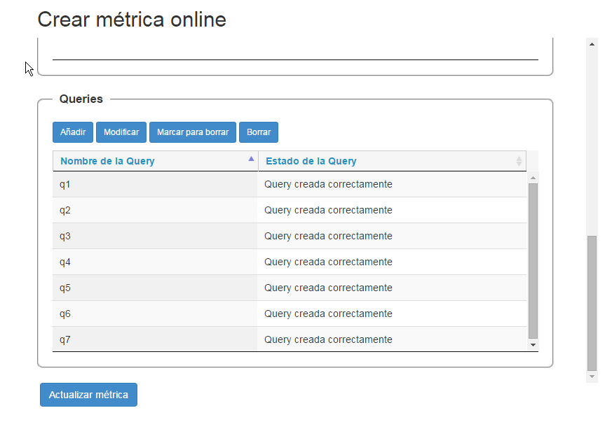

# Consola Web - Manual de usuario                                                        |
## Proyecto: Análisis de logs Big Data                                  
### PLATAFORMA DE ANÁLISIS Y EXPLOTACIÓN DE LOGS.                            
#### La Finca - Planta 2

# Índice

1. Introducción
2. Autenticación
3. Menú principal
4. Crear métrica batch
5. Consultar métrica batch
6. Crear métrica online
7. Consultar métrica online

# 1.Introducción
La consola web es una herramienta para poder gestionar las métricas
tanto batch como online del sistema.

Para las métricas batch la consola permite
su creación en su base de datos relacional **MySql** así como su
lanzamiento en el servidor contra **Hive**. Previamente el sistema de
ficheros distribuido, **Hadoop**, debe de estar cargado con los datos
que se vayan a procesar por las métricas. Una vez generados esos datos
en **Hive** se almacenarán también en **Elasticsearch** para
posteriormente poder ser explotados por **Kibana**.

Para las métricas online, la consola permite
su definición y creación en la su base de datos relacional **MySql** y
proporcionará una serie de servicios externos que servirán para poder
gestionar las topologías **Storm** y posteriormente poder explotar los
datos.
 
# 2.Autenticación

La dirección para accede a la consola es
<http://180.133.240.175:8080/web_console>

El sistema requiere un usuario y contraseña para poder acceder. Por el
momento existe el usuario admin, que tendrá todos los permisos, con la
contraseña admin.

# 3.Menú principal

Al realizar la autenticación con éxito se accederá al menú principal de
la consola. En él se podrá observar un panel en el lado izquierdo de la
pantalla donde aparecen las cuatro opciones de creación y consulta para
las métricas batch y online. Y un panel superior donde se puede cambiar
el idioma a inglés o español y cerrar la sesión del navegador.

La opción de crear métrica batch permite
crear la métrica batch en el sistema.

La opción de consultar métrica batch permite
consultar todas las métricas batch del sistema así como poder
modificarlas, relanzarlas o borrarlas.

La opción de crear métrica online permite
crear la métrica online en el sistema.

La opción de consultar métrica online
permite consultar todas las métricas online del sistema así como
poder modificarlas o marcarlas para borrar.

# 4.Crear métrica batch

Los campos marcados con asterisco indican que son obligatorios de
rellenar.

Una métrica se podrá lanzar sobre un origen de datos que tendrá sus
campos a utilizar, si se cambia de origen los campos se actualizarán en
la pantalla.

Existen indicadores de ayuda en los campos para facilitar la sintaxis de
la métrica a crear.

Un ejemplo de creación de métrica batch sería:

- Nombre de métrica: **primult\_correo**

- Descripción: **Primer y último correo por cada mes**

- Orígenes de datos: **ob\_src\_postfix** (Campo no editable cuando se
modifique o consulte la métrica)

- Campos: Son los campos del origen con los que se puede construir la
métrica, tiene sólo carácter informativo.

- Tipo: **Batch**

- Query Type: **ID STRING, MES INT, ANO INT, ULTIMO STRING, PRIMERO
STRING**

- Query Select: **SELECT
CONCAT(YEAR(eventTimeStamp),MONTH(eventTimeStamp)) as
ID,MONTH(eventTimeStamp) as MES,YEAR(eventTimeStamp) as
ANO,MAX(eventTimeStamp) as ULTIMO,MIN(eventTimeStamp) as PRIMERO**

- Query From: **FROM ob\_src\_postfix** (Campo no editable, se construye a
través del campo Orígenes de datos)

- Query Where: **WHERE MSGID is not NULL and QMGRID is not NULL and
USERFROM !='null' GROUP BY MONTH(eventTimeStamp),
YEAR(eventTimeStamp).**

Si la métrica se ha guardado con éxito en la base de datos se procederá
a ejecutar en el sistema y se redireccionará al usuario a la página de
consultar todas las métricas batch. Si se produjera un error en el
guardado se indicará con un texto descriptivo en la propia página de la
creación de la métrica.

# 5.Consultar métrica batch

En la tabla aparecerán todas las métricas de tipo batch creadas por la
consola. Se podrán modificar o borrar haciendo click en cualquiera de
las filas de la tabla.

Cada una de las métricas tendrá un campo estado que indicará el proceso
en el que se encuentra la métrica. Los estados serán:

*OK*, que
indicará que la métrica se ha creado y lanzado con éxito. 
*En ejecución*,
que indicará que la métrica se ha creado y se está lanzando en ese
momento.

*Error*, que
indicará que la métrica se ha creado con error o bien se ha creado con
éxito pero se ha lanzado y el servidor ha devuelto un código de error.
Si esto ocurriera la etiqueta de estado de error proporcionará un texto
descriptivo del mismo al usuario mediante un tooltip.

La tabla podrá ser refrescada con el botón de color verde para ver el
estado en el que se encuentra la métrica.

Si la métrica se lanzara con éxito se habilitará un botón de relanzar
métrica por si fuera necesario lanzar en otra ocasión, si no se lanzara
con éxito ese botón no estará habilitado.

Así mismo existirá un cuadro de búsqueda en la tabla que actuará en
todos los textos de la misma, es decir, que cualquier texto que se
indique en la caja afectará a todas las columnas de la tabla.

# 6.Crear métrica online

Los campos marcados con asterisco indican que son obligatorios de
rellenar.

Una métrica se podrá lanzar sobre un origen de datos que tendrá sus
campos a utilizar, si se cambia de origen los campos se actualizarán en
la pantalla.

Se tendrá que indicar un stream con sus campos, y ‘n’ queries y tablas
asociadas a la métrica.

Se podrán añadir las queries y tablas que se quiera asociadas a la
métrica en la tabla adecuada para ello. Las tablas son datos opcionales,
sirven para guardar estados si procediera.

Al pulsar el botón guardar métrica se procederá al guardado en base de
datos de la misma. Si fuera con éxito se redireccionará al usuario a la
página de consultar todas las métricas online. Si se produjera un error
en el guardado se indicará con un texto descriptivo en la propia página
de la creación de la métrica.

*Tablas Cep*

*Queries Cep*

####Query 1

####Query 3

Existen indicadores de ayuda en los campos para
facilitar la sintaxis de las queries de la métrica a crear. 

Un ejemplo de creación de métrica online sería:

- Nombre de métrica: **radius** (Campo no editable cuando se modifique o
consulte la métrica)

- Descripción: **radius desc**

- Orígenes de datos: **ob\_src\_radius** (Campo no editable cuando se
modifique o consulte la métrica)

- Campos: Son los campos del origen con los que se puede construir la
métrica, tiene sólo carácter informativo.

- Nombre del stream: **radius**

- Campos del stream: **ACS\_Timestamp string,TIMESTAMP\_MILLIS
long,Access\_Service string, User\_Name string,Calling\_Station\_ID
string,Authentication\_Status string,Failure\_Reason string **

-*Table1*:

- Nombre: **hosts**

- Campos: **ID long, maquina string, mac string, cuenta long**

-*Query1*:

- Nombre: **q1**

- Query From: **from radius[(User\_Name contains 'host/')]**

- Query Into: **insert into hosts**

- Query As: **select TIMESTAMP\_MILLIS as ID,User\_Name as maquina,
Calling\_Station\_ID as mac, count(1) as cuenta**

-*Query3*:

- Nombre: **q3**

- Query From: **from radius[not(User\_Name contains 'host/') and
Access\_Service=='802.1x\_SanHQ']**

- Query Into: **insert into peticionesUsuario**

- Query As: **select ACS\_Timestamp as timestamp, TIMESTAMP\_MILLIS as
ID,User\_Name as usuario, Calling\_Station\_ID as mac,
Authentication\_Status as status, Failure\_Reason as motivo**

- Formato ES: **timestamp date, ID long,usuario string, mac string, status
string,motivo string**

- TTL ES: **180s**

- Type ES: **radius\_peticionesusuario** (Campo no editable, se construye
con el campo nombre de la métrica + parte
del campo Query Into)

# 7.Consultar métrica online

En la tabla aparecerán todas las métricas de tipo online creadas por la
consola que no estén marcadas para borrar. Se podrán modificar, marcar
para borrar o borrar definitivamente haciendo click en cualquiera de las
filas de la tabla.

Cada una de las métricas tendrá un campo estado que indicará el proceso
en el que se encuentra la métrica. Si ha ocurrido un error en la
creación o actualización de la métrica el estado se indicará en color
rojo y se informará mediante un tooltip del mismo con un texto más
descriptivo.

La tabla podrá ser refrescada con el botón de color verde para ver el
estado en el que se encuentra la métrica.

Al igual que en la consulta de las métricas batch existirá un cuadro de
búsqueda en la tabla que actuará en todos los textos de la misma, es
decir, que cualquier texto que se indique en la caja afectará a todas
las columnas de la tabla.

